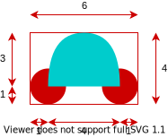

# Opravný termín 2 \[60b], 28.6.2021 14:00
B-OOP 2021

Vytvorte oknovú aplikáciu, ktorá umožní používateľovi kresliť a presúvať tvar. Aplikácia bude mať nasledovnú funkcionalitu (40 bodov):

1. Vytvorenie hlavného okna, ktoré bude obsahovať Ovládacie prvky a Kresliacu plochu \[4b].
2. Sfunkčnenie ovládacích prvkov pomocou Listenerov \[5b].
3. Kreslenie tvaru auto \[15b].
4. Presúvanie nakreslených tvarov \[10b].
5. Zmena farieb \[5b].
6. Zatvorenie aplikácie cez tlačidlo na zatvorenie aplikácie poskytnuté operačným systémom \[1b].

## Podrobný popis k bodu 1:

Väčšinu plochy okna bude zaberať Kresliaca plocha. V hornej časti okna sa budú nachádzať Ovládacie
prvky. Ovládacie prvky budú tvoriť: [JButton](https://docs.oracle.com/en/java/javase/11/docs/api/java.desktop/javax/swing/JButton.html) “Auto”, [JButton](https://docs.oracle.com/en/java/javase/11/docs/api/java.desktop/javax/swing/JButton.html) “Presun”, [JComboBox](https://docs.oracle.com/en/java/javase/11/docs/api/java.desktop/javax/swing/JComboBox.html) na výber farby a [JLabel](https://docs.oracle.com/en/java/javase/11/docs/api/java.desktop/javax/swing/JLabel.html). Každý z týchto prvkov musí zaberať štvrtinu celkového miesta vyhradeného pre ovládacie prvky.

## Podrobný popis k bodu 2:

Po spustení programu je zvolený mód "Auto". Aktuálne zvolený mód sa zobrazuje ako text na [JLabel](https://docs.oracle.com/en/java/javase/11/docs/api/java.desktop/javax/swing/JLabel.html) elemente na ovládacom paneli ("Auto", "Presun"). Aktívny mód sa zmení iba kliknutím na príslušný [JButton](https://docs.oracle.com/en/java/javase/11/docs/api/java.desktop/javax/swing/JButton.html) na ovládacom panely. Label má nastavenú farbu pozadia podľa aktuálne zvolenej farby (pozri bod 5).

## Podrobný popis k bodu 3:

Keď je zvolený mód "Auto" tak po klikutí myšou na kresliacu plochu sa zobrazí tvar auta zaberajúci obdĺžnik o veľkosti 1x1 jednotku s ľavím horným rohom v mieste kliknutia, pričom veľkosť jednej jednotky je nutné zvoliť nejako rozumne (napr. 50px). Po stlačení šípky na klávesnici sa rozmer obdĺžnika zväčší alebo zmenší v danom smere o jednu jednotku, pričom tvar v obdĺžniku sa rozťahuje podľa jeho rozmerov \[5b]. Obdĺžniku je možné v jednom, alebo oboch smeroch nastaviť "záporný" rozmer - obrázok je možné vykresľovať do všetkých 4 kvadrantov \[5b]. Po stlačení klávesy ENTER sa ukončí kreslenie aktuálneho tvaru a už mu nie je možné ďalej meniť rozmery. Po stlačení klávesy ESC sa aktuálne kreslený tvar odstráni. Po kliknutí myšou počas kreslenia sa aktuálny tvar zafixuje a začne sa kresliť nový tvar v mieste kliknutia myši \[5b]. Tvar má mať nasledovné proporcie a je celý vykreslený jednou farbou:

**Pozn.:** Na vykreslenie poloblúka auta môžete použiť napríklad meódu [fillArc](https://docs.oracle.com/en/java/javase/11/docs/api/java.desktop/java/awt/Graphics.html#fillArc(int,int,int,int,int,int)).

## Podrobný popis k bodu 4:

Keď je zvolený mód "Posun" je možné ťahaním posúvať nakreslené tvary \[3b]. Ťahanie má prebiehať relatívne k pozícii myši \[4b]. Ťahať je možné len tvary ktorých farba je rovnaká, ako aktuálne zvolená farba \[3b].

Na detekciu kliknutia myši na tvar môžete použiť napríklad metódu [contains](https://docs.oracle.com/en/java/javase/11/docs/api/java.desktop/java/awt/Shape.html#contains(double,double)) triedy [Shape](https://docs.oracle.com/en/java/javase/11/docs/api/java.desktop/java/awt/Shape.html)

## Podrobný popis k bodu 5:

Program obsahuje minimálne 3 farby (napr. červená, modrá, zelená). Po spustení programu je zvolená nejaká z dostupných farieb. Aktuálne zvolenú farbu je možné meniť pomocou dropdown menu realizovaného pomocou [JComboBox](https://docs.oracle.com/en/java/javase/11/docs/api/java.desktop/javax/swing/JComboBox.html) komponentu. Po zmene farby sa zmení farba Label-u podľa aktuálnej farby. Zmena farby ovplyvňuje len nové geometrické tvary, už nakreslené geometrické tvary si musia zachovať svoju farbu!

## Hodnotenie

Projekt obsahuje github pipeline, ktorá kontroluje skompilovateľnosť programu. **Pokiaľ program nie je skompilovateľný nebude hodnotený a skúška bude hodnotená 0b!**

**Pokiaľ budete počas skúšky pristihnutý pri podvádzaní, alebo bude váš kód vykazovať príliš veľkú podobnosť s kódom iných študentov, bude skúška hodnotená 0 bodmi!**

Okrem funkcionality budú hodnotené aj princípy Objektovo orientovaného programovania (20 bodov), najmä:

* správne využitie modifikátory prístupu, \[3b]
* vhodné pomenovanie tried a metód, \[3b]
* vhodné využitie dedenia a polymorfizmu, \[3b]
* vhodné použitie výnimiek na ošetrenie nedovoleného správania (nehádzať a nezachytávať všeobecnú triedu Exception), \[3b]
* nepoužitie vnorených tried (nested class), \[2b]
* nepoužitie statických metód ani nekonštantných statických premenných, \[3b]
* nepoužitie duplicitných kódov \[3b]

Pokiaľ vaše riešenie neobsahuje dostatok implementácie je možné za OOP získať maximálne \[10b]. 

## Odovzdanie

Vypracovanie skúšky odovzdajte cez Github classroom do miesta odovzdania nato určenom. Odovzdáva sa obsah celého projektu. Na vypracovanie písomky je vyhradený čas 3 hodiny.